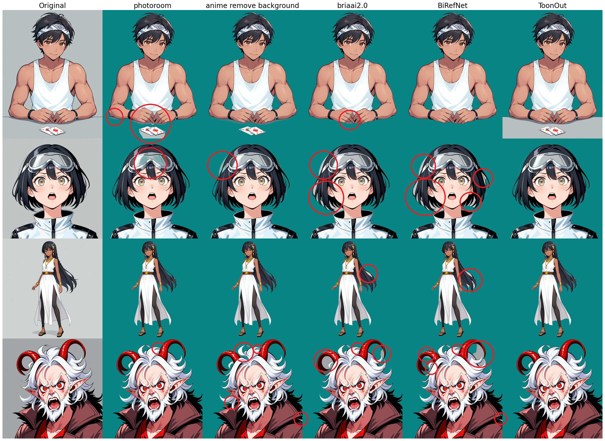
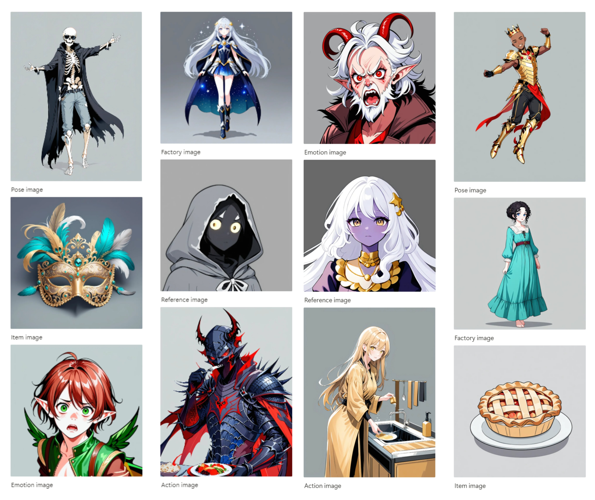
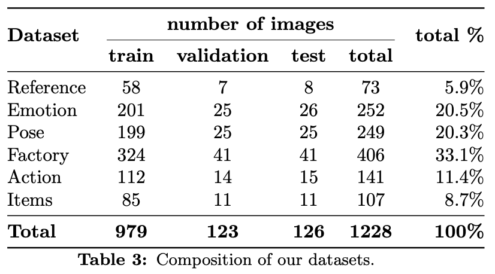

# ToonOut: Fine-tuned Background Removal for Anime Characters



[](LICENSE)  
Code and model weights are released under the **MIT License**.  
Dataset is released under the **CC-BY 4.0 License** (see [LICENSE-DATASET](LICENSE-DATASET)).  

---

## Abstract

While state-of-the-art background removal models excel at realistic imagery, they frequently underperform in specialized domains—such as anime-style content, where complex features like hair and transparency present unique challenges.

To address this limitation, we collected and annotated a custom dataset of **1,228 high-quality anime images** of characters and objects, and fine-tuned the open-sourced **BiRefNet** model on this dataset. The resulting model, **ToonOut**, shows marked improvements in background removal accuracy for anime-style images, achieving an increase in Pixel Accuracy from **95.3% to 99.5%** on our test set.

We are open-sourcing the **code, fine-tuned model weights, and dataset**.

---

## Repository Structure

```
├── birefnet/           # Core library code
├── scripts/            # Python scripts (training, evaluation, etc.)
├── bash_scripts/       # Bash entrypoint scripts
├── LICENSE             # MIT License (code + weights)
└── LICENSE-DATASET     # CC-BY 4.0 License (dataset)

```

---

## Features

This repository is a fork of the original BiRefNet with enhanced functionality and corrected settings for anime-style background removal.

### Code

- **Adjusted Training Settings**: Added `train_finetuning.sh` with proper configuration to avoid NaN gradient problems (switched to `bfloat16` data type)
- **Fixed Evaluation**: Added `evaluations.py` with corrected settings from the original `eval_existingOnes.py`
- **Reorganized Structure**: Separated code into three organized folders:
  - `scripts/` for Python scripts
  - `bash_scripts/` for bash entrypoint scripts  
  - `birefnet/` for core library files

### 5 Fundamental Scripts

Each Python script has a corresponding bash script for easy execution:

1. **Data Splitting**: Takes original and annotated image folders → splits into train/validation/test sets
2. **Training**: Trains the neural network → saves checkpoints to a folder
3. **Testing**: Takes a checkpoint → generates and saves predictions
4. **Evaluation**: Takes model predictions → computes metrics on the test set
5. **Visualization**: Takes predictions from multiple models (fine-tuned/baseline/external) → visualizes results and ranks models by chosen metrics

### 3 Additional Utility Scripts

- **Baseline Predictions**: Generate baseline model predictions from RGB input folders
- **Alpha Mask Generation**: Extract alpha channel masks from RGBA annotated images
- **Photoroom Integration**: Generate Photoroom API predictions from RGB folders  

---

## Installation

```bash
git clone https://github.com/MatteoKartoon/BiRefNet.git
cd BiRefNet
pip install -r requirements.txt
```

---

## Usage

### Training

```bash
bash bash_scripts/train_finetuning.sh
```

### Evaluation

```bash
python scripts/evaluations.py --checkpoint path/to/checkpoint
```

---

## Dataset

The dataset consists of 1,228 annotated anime images, curated and labeled for background removal tasks.



- **License**: CC-BY 4.0 (must credit authors).
- **Hugging Face Dataset**: [https://huggingface.co/datasets/joelseytre/toonout](https://huggingface.co/datasets/joelseytre/toonout)

### Dataset Composition



### Dataset Structure

The dataset is organized into `train`, `test`, and `val` splits, with each split containing multiple generation folders. Within each generation folder, you'll find three subfolders:

- **`im/`**: Raw RGB images
- **`gt/`**: Ground truth transparency masks
- **`an/`**: Combined RGBA images with transparency

```
toonout_dataset/
├── train/
│   ├── train_generations_20250318_emotion/
│   │   ├── im/    # RGB images
│   │   ├── gt/    # Ground truth masks
│   │   └── an/    # RGBA annotated images
│   └── train_generations_*/...
├── test/
│   └── test_generations_*/...
└── val/
    └── validation_generations_*/...
```

---

## Model Weights

The fine-tuned ToonOut weights are provided for easy inference.

- **License**: MIT.
- **Hugging Face Model**: [https://huggingface.co/joelseytre/toonout](https://huggingface.co/joelseytre/toonout)

Example usage:

**coming soon**

---

## Paper

This repository accompanies the paper:

**ToonOut: Fine-tuned Background Removal for Anime Characters**  
Matteo Muratori (University of Bologna, Kartoon AI), Joël Seytre (Kartoon AI)

- **arXiv**: [https://arxiv.org/abs/2509.06839](https://arxiv.org/abs/2509.06839)

---

## Citation

If you use this work, please cite:

```bibtex
@misc{muratori2025toonout,
  title={ToonOut: Fine-tuned Background Removal for Anime Characters},
  author={Muratori, Matteo and Seytre, Joël},
  year={2025},
  eprint={2509.06839},
  archivePrefix={arXiv},
  primaryClass={cs.CV},
  url={https://arxiv.org/abs/2509.06839},
  doi={10.48550/arXiv.2509.06839}
}
```

---

## Acknowledgements

This project is forked from BiRefNet, originally licensed under MIT.